```{r include=FALSE}

knitr::opts_chunk$set(
#  class.source = "numberLines lineAnchors",
#  class.output = c("numberLines lineAnchors chunkout")
)

options(htmltools.dir.version = FALSE)
options(servr.daemon = TRUE)

JuliaCall::julia_markdown_setup(JULIA_HOME = "/opt/julia/bin", notebook = TRUE)
```


--- 

# Plan for today

- What is Julia and short comparison

--

- Data Science - COVID 19 as an example

--

- Machine Learning - the Julia Flux.jl library

---
class: inverse, center, middle

# What is Julia?

---
# High-level features

**Easy to use**: Julia has high level syntax, making it an accessible language for programmers from any background or experience level. 

--

**Dynamic**: Julia is dynamically-typed, feels like a scripting language, and has good support for interactive use.

--

**Optionally typed**: Julia has a rich language of descriptive datatypes, and type declarations can be used to clarify and solidify programs.

--

**General**: Julia uses multiple dispatch as a paradigm, making it easy to express many object-oriented and functional programming patterns. 

--

**Julia is fast!**: Julia was designed from the beginning for high performance. Julia programs compile to efficient native code for multiple platforms via LLVM.

--

**Open source**: Julia is provided under the MIT license, free for everyone to use. All source code is publicly viewable on GitHub.

---
# Why We Created Julia 

## (from the authors)

We want a language that's __open source__, with a liberal license. We want the __speed of C__ with the __dynamism of Ruby__. We want a language that's homoiconic, with __true macros like Lisp__, but with __obvious, familiar mathematical notation like Matlab__. We want something as usable for __general programming as Python__, as easy for __statistics as R__, as natural for string processing as Perl, as powerful for linear algebra as Matlab, as good at gluing programs together as the shell. Something that is dirt simple to learn, yet keeps the most serious hackers happy. We want it interactive and we want it compiled.

(Did we mention it should be as fast as C?)

We never want to mention types when we don't feel like it. But when we need __polymorphic functions__, we want to use __generic programming__ to write an algorithm just once and apply it to an infinite lattice of types; we want to use __multiple dispatch__ to efficiently pick the best method for all of a function's arguments, from dozens of method definitions, providing common functionality across drastically different types. Despite all this power, we want the language to be __simple and clean__.

_Source: [https://julialang.org/blog/2012/02/why-we-created-julia/](https://julialang.org/blog/2012/02/why-we-created-julia/)_

## And they did it!

---
# Easy to use

- Interactive REPL like Python or R. Julia is the _Ju_ in Jupyter

- Your preferred IDE supports it. Atom is the most mature, but VS Code, VIM, Emacs, SublimeText work fine. (This presentation is made with RStudio which can include Julia in its markdown.)

- Great community active and helpful on Discourse and Slack.


---
# It is fast - (Old) Benchmark

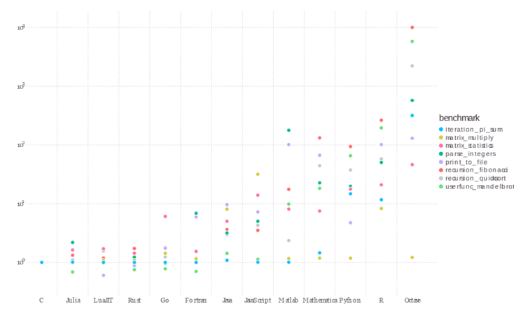

_Julia v1.0.0, SciLua v1.0.0-b12, Rust 1.27.0, Go 1.9, Java 1.8.017, Javascript V8 6.2.414.54, Matlab R2018a, Python 3.6.3 (NumPy v1.14.0), R 3.5.0, and Octave 4.2.2. C and Fortran are compiled with gcc 7.3.1. See [https://julialang.org/benchmarks/]()_

---
class: inverse, center, middle

# Fast means _really_ fast

## `LoopVectorization.jl`

(Recent library, pure Julia, available on any platform supported by LLVM)

---
# Matrix multiplication

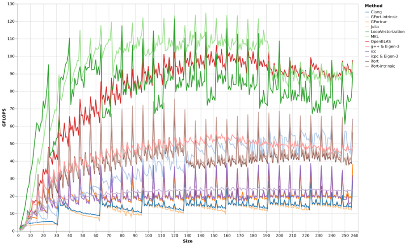

---
# Matrix-vector multiplication

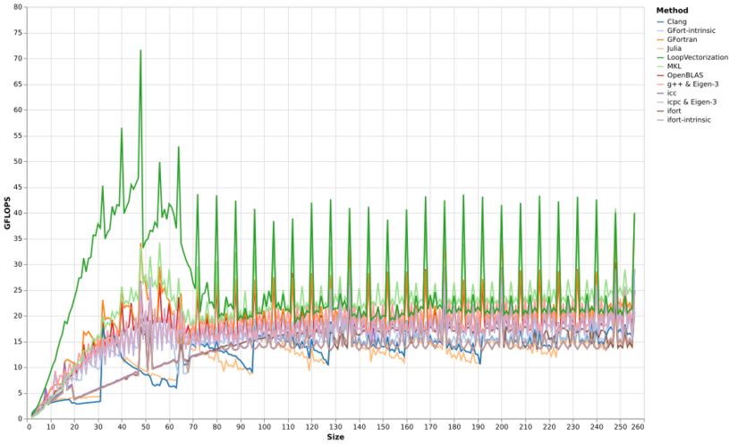
---
# Sum-squared error

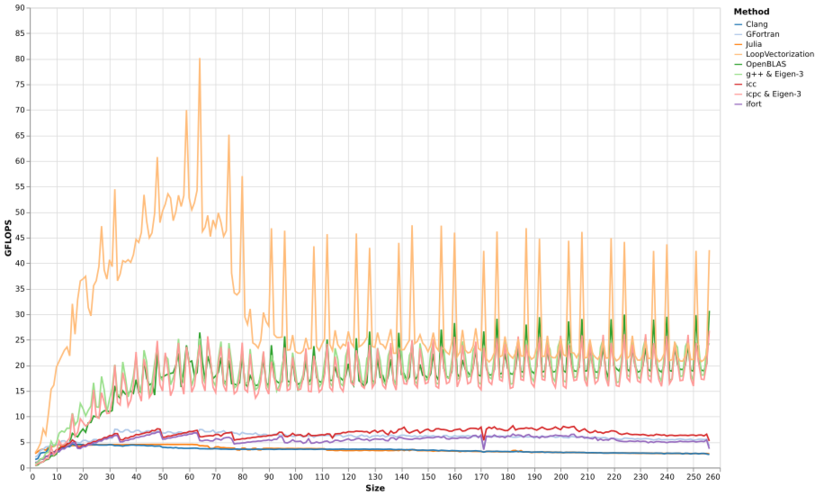


---
# Image kernel convolution

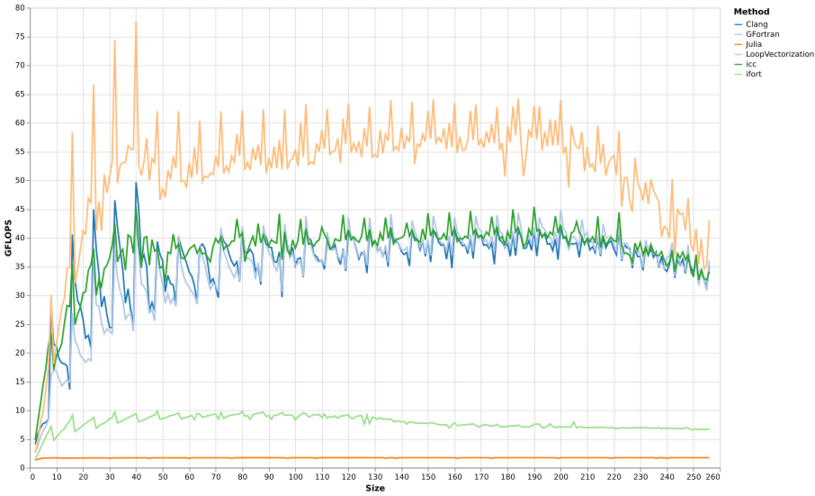


---
# No cheating - unknown kernel size at compile time

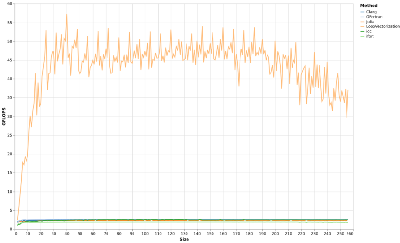

---
class: center
# It is also pretty!

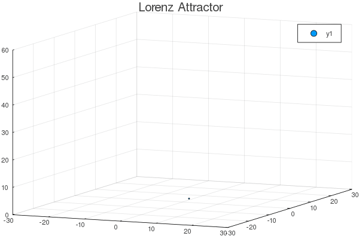
[https://docs.juliaplots.org/](https://docs.juliaplots.org/latest/)

---
# Code walk

$$
\frac{dx}{dt} = \sigma \left( y - x \right) \mbox{   ;    }
\frac{dy}{dt} = x \left( \rho - z \right) - y  \mbox{   ;    }
\frac{dz}{dt} = x y - \beta z
$$

--

```{julia eval=FALSE,cache=FALSE}
using Plots

# define a structure to gather the Lorenz attractor's parameters
Base.@kwdef mutable struct LorenzAttractor
    x::Float64 = 1;         y::Float64 = 1;         z::Float64 = 1;
    σ::Float64 = 10;        ρ::Float64 = 28;        β::Float64 = 8/3;   dt::Float64 = 0.02
end

l = LorenzAttractor()

function step!(l::LorenzAttractor)
    dx = l.σ * (l.y - l.x); dy = l.x * (l.ρ - l.z) - l.y;  dz = l.x * l.y - l.β * l.z;
    l.x += l.dt * dx;       l.y += l.dt * dy;              l.z += l.dt * dz
end

# initialize a 3D plot with 1 empty series
plt = plot3d(1, title = "Lorenz Attractor", marker = 2,
                xlim = (-30, 30),   ylim = (-30, 30),   zlim = (0, 60))

# build an animated gif by pushing new points to the plot, saving every 10th frame
@gif for i = 1:1500
    step!(l)                          # Calculate the next point
    push!(plt, l.x, l.y, l.z)         # Add that point to the plot
end every 10
```


---
# Generic function / Multiple dispatch 

- Generic functions (Common Lisp, R S3, R S4) - Not message passing (e.g. Java, C++, Python, R Reference Classes and S6)

- Multiple dispatch on the entire type signature of the method (Common Lisp, R S4), not just on the first one (e.g. R S3, Python)

- Better at code reuse than message-passing OO:

  - No need to sub-class: no new class, can provide completely different representation.
  
  - No need to reimplement all methods.
  
- More natural fit for scientific programming where functions (of any number of parameters) are everywhere.

- Recommended viewing: _The Unreasonable Effectiveness of Multiple Dispatch_ by Stefan Karpinski


---
# This is why you can write this

$$
\begin{align}
a, b &\in \mathbb{R} \\
A,B &\in \mathbb{R}^{m \times n} 
\end{align}
$$

$$
aA + bB
$$

.pull-left-50[
## Python (and Numpy)

```{python eval=FALSE}
import numpy
A = B = [[1, 2], [3, 4]]

# 2.A + 3.B
numpy.add(numpy.multiply(2, A), 
          numpy.multiply(3, B))
```
]

.pull-right-50[
## Julia

```{julia eval=FALSE}
A = B = [1 2; 3 4]
2 * A + 3 * B
```

or better looking (the language specifies how to enter many useful Unicode characters)

```
Γ = Λ = [1 2; 3 4]
2 * Γ + 3 * Λ
```
]


---
# Typing and multiple dispatch example: addition (1/2)

## Julia first compiles to LLVM

```{julia cache=FALSE,message=FALSE,echo=FALSE}
using InteractiveUtils
```

.pull-left-50[
```{julia cache=FALSE}
function add_mult(a::Int64, b::Int64)::Int64
  return a + b * 7
end

@code_llvm debuginfo=:none add_mult(2, 3)
```
]

--

.pull-right-50[
```{julia cache=FALSE}
function add_mult(a::Float64, b::Float64)::Float64
  return a + b * 7.0
end;


@code_llvm debuginfo=:none add_mult(2.0, 3.0)
```
]

--

**Compilation is not Ahead of Time or Just in Time. It is Just Ahead of Time.**

---
# Typing and multiple dispatch example: addition (2/2)

## Then LLVM to Assembly


.pull-left-50[
```{julia cache=FALSE,eval=FALSE}
function add_mult(a::Int64, b::Int64)::Int64
  return a + b * 7
end
```

```{julia cache=FALSE}
@code_native debuginfo=:none add_mult(2, 3)
```
]

--

.pull-right-50[
```{julia cache=FALSE,eval=FALSE}
function add_mult(a::Float64, b::Float64)::Float64
  return a + b * 7.0
end;
```

```{julia cache=FALSE}
@code_native debuginfo=:none add_mult(2.0, 3.0)
```
]

---
# Multiple dispatch is used extensively 

For example, the `+` function:

```{julia}
length(methods(+))
```


```{julia}
@show first(methods(+))
```

---
# Typing

If we had just defined `function add(x, y) return x + y end`, same result.

--

But typing catches bugs, the compiler can skip sorting through methods, and yields clearer code.

--

- Julia has a whole zoo of different types: Primitive, Abstract vs. Concrete, Immutable vs. Mutable Composite, Union, Parametric, Aliases...

- Key points:

  - Dynamic typing when early development, strong typing to catch bugs later.

  - High-level code is easy to express with Abstract and Parametric types: 
  
    + `Int64` is a subtype of `Integer`, and `Float`  is a subtype of `AbstractFloat`, which are subtypes of `Number`.
    
    + You can have `Matrix(Float64)` or `Matrix{Int64}`


  - Sub-typing (and generic functions) allows easy algorithmic specialisation and high speed
  
    + Easy to specialise on `DenseArray` or `SparseArray` for specific algorithms, but default to generic algorithms for others (just an example).
  

---
class: inverse, center, middle

# Data science with COVD19 

---
# Background

This part is about fitting a model to a set of data. It is not machine learning is the sense of guessing a model that best fits data.

It was born after reading a report from Imperial College London and viewing a forecasting model by [NeherLab](https://neherlab.org/covid19/). 


There are 4 types of epidemiological models:

- **Agent-based models** simulate a population that mimics a real population. The disease is then propagated via agents through the simulated population. Stochastic simulation.

- **Machine learning/regression models** are models that learn historical patterns and leverage those patterns for forecasting. This group includes such approaches as statistical time series, linear or regularized regression, clustering, and nonparametric approaches, often characterized by the absence of a mechanistic model.

- **Mechanistic models** are differential-equation model descriptions of the disease transmission mechanism. They include a class of models referred to as compartmental models that partition a population into compartments and mathematically describe how individuals in the population move between compartments.

- **Data-assimilation/dynamic models** usually involve embedding a mechanistic model into a probabilistic framework, allowing for the explicit modeling of the disease transmission process and observational noise with stochastic and/or Bayesian formalism. That is, the dynamic modeling approach combines two sources of uncertainty in the modeling; parametric uncertainty in the mechanistic model and random uncertainty in the observations.

(Only snippets of code included.)

---
# Overview 

The **mechanistic** model works as follows:

- susceptible individuals are exposed and infected through contact with contagious individuals. Each contagious individual causes on average $R_0$ new infections.

- Transmissibility of the virus could have seasonal variation which is parameterised with the parameter “seasonal forcing” (amplitude) and “peak month” (month of most active transmission).

```{julia eval=FALSE}
# Seasonal forcing parameter ϵ
const ϵ = Dict(:north => 0.2, :tropical => 0.0, :south => 0.2)

# Gives R_0 at a given date
function R₀(d; r₀ = baseR₀, latitude = :north)
    eps = ϵ[latitude]
    peak = peakDate[latitude]

    return r₀ * (1 + eps * cos(2.0 * π * (d - peak) / 365.25))
end
```

- Exposed individuals progress through sequential conditions after an average latency: asymptomatic $\rightarrow$ symptomatic  $\rightarrow$ severe $\rightarrow$ critical $\rightarrow$ death. At each stage, an individual can recover.


---
# Age cohorts

- The proportion/probability of passing from condition to condition depends on age

- How to use what is seen in one country in another country? Age pyramid accounts for a lot of the differences. 

- COVID-19 is much more severe in the elderly and proportion of elderly in a community is therefore an important determinant of the overall burden on the health care system and the death toll. We collected age distributions for many countries from data provided by the UN and make those available as input parameters. Furthermore, we use data provided by the epidemiology group by the Chinese CDC to estimate the fraction of severe and fatal cases by age group.

```{julia eval=FALSE}
#-- Susceptibility to contagion and transition from a compartment to another
const AgeGroup = ["0-9", "10-19", "20-29", "30-39", "40-49", "50-59", "60-69", "70-79", "80+"]
const zₐ =       [0.05,   0.05,   0.10,    0.15,    0.20,    0.25,    0.30,    0.40,    0.50]
const mₐ =       [0.01,   0.03,   0.03,    0.03,    0.06,    0.10,    0.25,    0.35,    0.50]
const cₐ =       [0.05,   0.10,   0.10,    0.15,    0.20,    0.25,    0.35,    0.45,    0.55]
const fₐ =       [0.30,   0.30,   0.30,    0.30,    0.30,    0.40,    0.40,    0.50,    0.50]
```

# Infrastructure

- Hospital beds and ICU units are limited.

- The probability of a condition becoming more severe is increased if appropriate care is not available: being in critical condition at home vs. in an ICU unit.


---
# Compartments

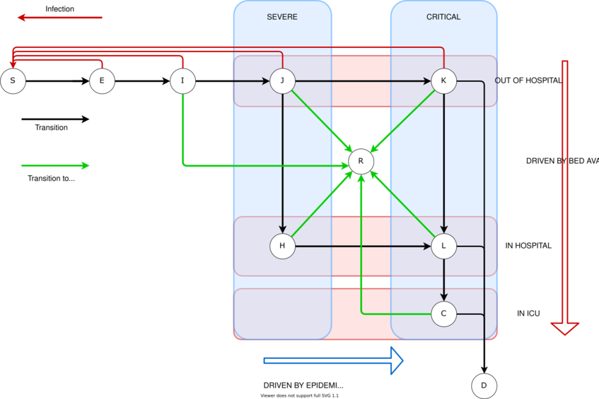
---
# Compartments

```{julia eval=FALSE}
const COMPARTMENTS = [["S",                 "Susceptible"],
                      ["E",                 "Exposed"],
                      ["I",                 "Infectious"],
                      ["J",                 "Severe"],
                      ["H",                 "Hospitalised"],
                      ["C",                 "ICU"],
                      ["R",                 "Recovered"],
                      ["F",                 "Fully_Recovered"],
                      ["D",                 "Dead"],
                      ["K",                 "Critical"],
                      ["L",                 "Critical_Hospitalised"]]

const COMPARTMENTS_LIST = [v[1] for v in COMPARTMENTS]
const COMPARTMENTS_N    = length(COMPARTMENTS_LIST)
```


---
# Transition rates

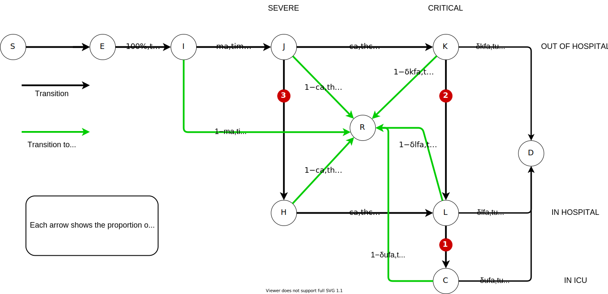

---
# Code: Differential equation for the evolution of the epidemy

```{julia eval=FALSE}
function epiDynamics!(dP, P, params, t)
    # Destructuring of the compartments with all age groups (P is just one very long vector!)
    c = 0
    S = P[c*nAgeGroup + 1:c*nAgeGroup + nAgeGroup]; c += 1
    
    ...
    
    # Destructuring of the individual parameters
    r₀, tₗ, tᵢ, tₕ, tᵤ, tᵣ,..,.  BED_max, ICU_max, Population = params

    ...    
    
    # EI means flow from compartment E to compartment I
    EI = ones(nAgeGroup) .* E / tₗ;  EI = max.(EI, 0.0001);     IE = -EI
    IJ = mₐ              .* I / tᵢ;  IJ = max.(IJ, 0.0001);     JI = -IJ
    
    ...
    
    # dS is the decrease of compartment S: how many people are infected.
    dS = - (sum(S)  / Population) .* β .* (γₑ.*E + γᵢ.*I + γⱼ.*J + γₖ.*K + γᵣ.*R)
    # Exposed
    dE = -dS + IE

    ...
    
    # Vector change of population and update in place
    result = vcat(dS, dE, dI, dJ, dH, dC, dR, dF, dD, dK, dL)
end
```

---
# ODE solution

```{julia eval=FALSE}
function calculateSolution(country, diseaseparams, countryparams;
                           finalDate::Union{Nothing, Date} = nothing)

    ...

    ## Compartment vectors of the initial conditions
    S0 = Age_Pyramid .- InfectedAtStart .- InfectiousAtStart .- DeathsAtStart
    E0 = InfectedAtStart
    I0 = InfectiousAtStart
    J0 = 0.0001 .* ones(Float64, nAgeGroup)

    ...

    P0 = vcat(S0, E0, I0, J0, H0, C0, R0, F0, D0, K0, L0)

    # Differential equation solver
    model = ODEProblem(epiDynamics!, P0, tSpan, model_params)

    sol = solve(model, Tsit5(); progress = false)

    return sol
end

```

---
# Initial results for Italy

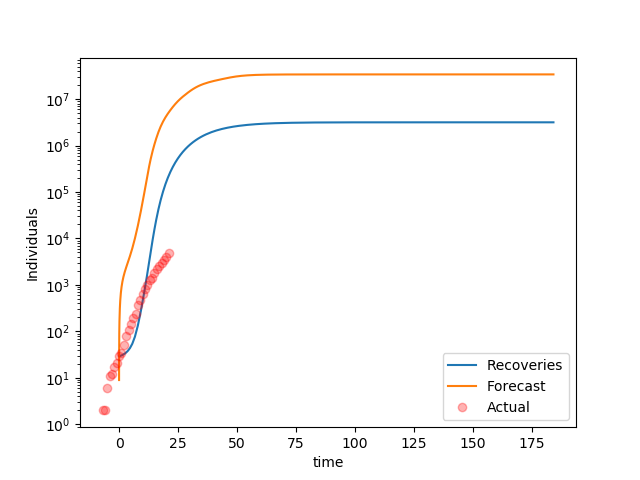

---
# Plot country

```{julia eval=FALSE}
function plotCountry(country::String; finalDate = Date(2020, 7, 1))
    plotly()

    sol = calculateSolution(country, DiseaseParameters,.......

    p = Plots.plot(title = country)

    xvar = countryData[country][:cases].t
    yvar = countryData[country][:cases].deaths
    p = Plots.scatter!(xvar, yvar, label = "", marker = :circle, markeralpha = 0.30)

    xvar = timeModel2Real.(sol.t, country)
    totalInCompartments = 0.0 .* getSummedCompartment(sol, "S")
    for c in COMPARTMENTS_LIST
        yvar = getSummedCompartment(sol, c)
        totalInCompartments = totalInCompartments .+ yvar

        p = Plots.plot!(xvar, yvar, label = c)
    end

    p = Plots.plot!(xvar, totalInCompartments, label = "Total")

    p = Plots.xaxis!("")
    p = Plots.yaxis!("", :log10)

    return Plots.plot(p)
end
```


---
# Bed usage

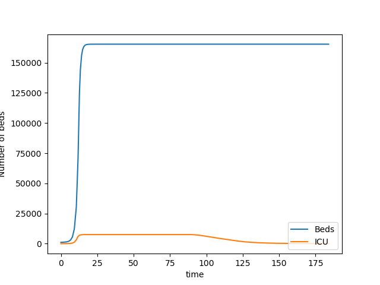

---
# Before optimisation

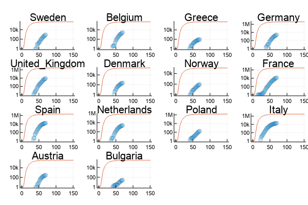


---
# After 3 minute optimisation

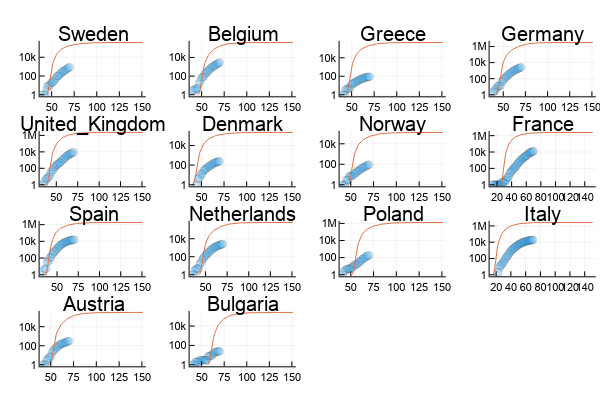
---
# Optimise every country

```{julia eval=FALSE}
using BlackBoxOptim

function updateEveryCountry(; maxtime = 60)
    for (country, _) in COUNTRY_LIST

      ...

      # Determine optimal parameters for each countryw
      result = bboptimize(p -> singleCountryLoss(country, DiseaseParameters, p),
                          SearchRange = countryRange;
                          Method = :adaptive_de_rand_1_bin,
                          MaxTime = maxtime,
                          TargetFitness = 2.0,
                          TraceMode = :compact)

      ...

    end
end
```


---
# Limitations

- This is just a model. The map is not the territory. SEIR models are notorious for over-inflating the spread of epidemies. 

- Modelling the effect of social measures / different countries, especially their change over time.

- Herd effect.

- More compartments (post-recovery contagion).

- Bayesian approach and probabilistic models account better for incremental information.


---
class: inverse, center, middle

# The `Flux.jl` machine learning library

Machine Learning Stack

---
# What is differentiable programming?

- Deep learning speed improvement have heavily relied on the introduction of automatic differentiation (calculation of a derivative at the cost of a single function call). 

- This is normally restricted to the differentiation of mathematic formulas.

- `Flux` adds algorithmic differentiation: for example `for` loops, `if` statements. This dramatically extends the universe of possibilities.

- `Flux` also easily offloads calculation to GPUs or TPUs (Google's tensor processing units).

- `Flux` small (few 1,000's of lines compared to millions for TF and PyTorch) and written in a single language (no Python, C, C++...)

---
# Examples

- Perceptron is a simple formula: optimise $Loss(y - \hat{y})$ for $y = \sigma(W . x + b)$. Autodiff is enough.

But this doesn't work for richer models:

- Image recognition with detailed physical model of lenses.

- X-Ray images feeding into a pharmacokinetics model to optimise drug dosage.

- Self-driving car with realistic physical model of car given various road conditions.  
 
- Example: Biomechanical model


---
# Code sample (1/2)

### Simple NN with 2 dense layers.

```{julia eval=FALSE,cache=FALSE}
using Flux

# Define a model of a dense layer
# σ is the activation function.
dense(W, b, σ = identity) = x -> σ.(W * x .+ b)

# For backpropagation, derivatives are calculated 
# starting from the end.
#  ∘ denotes function composition
chain(f...) = foldl(∘, reverse(f))

# Easy multilayer perceptron. 
# Final model output is the sum of the activations
mlp = chain(
    dense(randn(5, 10), randn(5), tanh), 
    dense(randn(2, 5), randn(2)))

# do notation is one way to declare an anonymous 
# function (lambda function)
x = rand(10)
δm = gradient(mlp) do m
    sum(m(x))
end

# Gradient descent - η: learning rate
m -= η * δm 
```

---
# Code sample (2/2)

### Let's offload that to the GPU with `Cuda`...

```{julia eval=FALSE,cache=FALSE}
using CuArrays

cuda() do
    δm = gradient(mlp) do m
        sum(m(x))
    end
end
```

--

### ... or use a model defined in `Python`

```{julia eval=FALSE,cache=FALSE}
using PyCall

py"""
  import torch.nn.functional as F
  def foo(W, b, x):
      return F.sigmoid(W @ x + b)
"""

δW, δb = gradient(W, b) do W, b
    sum( (foo(W, b, x) .- [0.0, 1.0]).^2 )
end
```


---
# Metalhead

## For computer vision models, see `Metalhead.jl`

.pull-left-60[
```{julia eval=FALSE,cache=FALSE}
using Metalhead
using Metalhead: classify

vgg = VGG19()
img = "Dog.jpg"


vgg.layers

# Chain(Conv((3, 3), 3=>64, relu), 
#       Conv((3, 3), 64=>64, relu), 
#       MaxPool((2, 2), pad = (0, 0, 0, 0), 
#       stride = (2, 2)), 
#       .....
#       Dense(25088, 4096, relu), Dropout(0.5), 
#       Dense(4096, 4096, relu), Dropout(0.5), 
#       Dense(4096, 1000), softmax))
```
]

.pull-right-40[

_(This is a random Internet dog...)_


```
Result: "Labrador retriever
```
]


---
# Thanks and links

NeherLab: https://neherlab.org/covid19/

Julia: [https://julialang.org]()

FluxML: [https://fluxml.ai/]()

LoopVectorization: [https://chriselrod.github.io/LoopVectorization.jl/latest/]()

[https://fluxml.ai/2019/02/07/what-is-differentiable-programming.html]()

Youtube channel: [https://www.youtube.com/user/JuliaLanguage]()

*** 

**References**:

_JuliaCon 2019 | The Unreasonable Effectiveness of Multiple Dispatch | Stefan Karpinski_ [https://www.youtube.com/watch?v=kc9HwsxE1OY]()

Osthus, D., Gattiker, J., Priedhorsky, R., & Del Valle, S. Y. (2019). _Dynamic Bayesian influenza forecasting in the United States with hierarchical discrepancy (with discussion)_. Bayesian Analysis, 14(1), 261-312. [https://arxiv.org/abs/1708.09481]()

_Introduction to SEIR Models_ by Nakul Chitnis, Workshop on Mathematical Models of Climate Variability, Environmental Change and Infectious Diseases [http://indico.ictp.it/event/7960/session/3/contribution/19/material/slides/0.pdf]()

*** 

Code written in **Atom** with the **JunoLab** extension.

Slides written in **RStudio** in [R Markdown]([https://rmarkdown.rstudio.com]()) and formatted with the [**Xaringan**]([https://github.com/yihui/xaringan]()) package.

(C) Emmanuel Rialland - [Emmanuel-R8.github.io]() & [www.linkedin.com/in/emmanuelrialland]()


